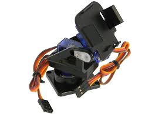
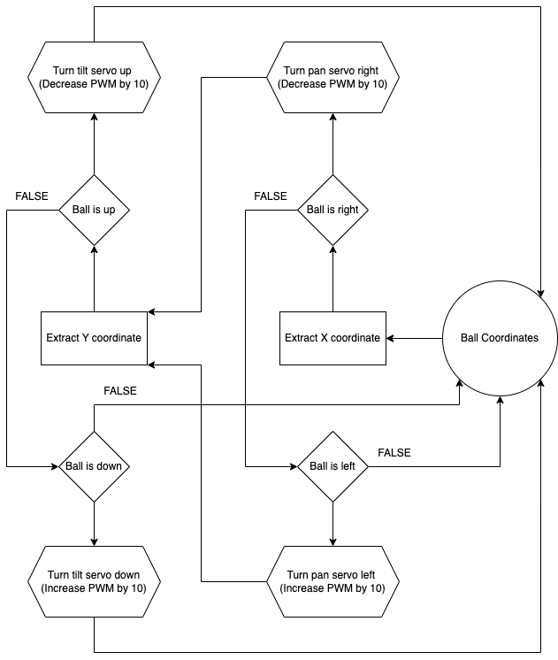

The Ball-tracking Robot uses the Raspberry Pi system along with the Open Computer Vision Library (OpenCV) to track a red ball with a camera. Once the ball is found, the robot drives, with 2 DC motors and a motor driver, towards the ball, gauging the distance to the ball with an ultrasonic sensor. In this portfolio, I will describe the process I took to assemble and program the robot, any materials I used along the way, along with relevant schematics and diagrams where neccesary.

| **Engineer** | **School** | **Area of Interest** | **Grade** |
|:--:|:--:|:--:|:--:|
| Yash S. | Leland High School | Mechanical Engineering / Robotics | Incoming Sophmore

<div style="display: flex; justify-content: space-around;">
  
  
</div>

*** 

# Modification 1
For my first modification, I have added a pan-tilt servo mount that allows the robot to track the ball while stationary and while moving.



*Figure 1: Image of my pan-tilt servo mount: [Link](https://www.google.com/url?sa=i&url=https%3A%2F%2Fbc-robotics.com%2Fshop%2Fpantilt-bracket-kit%2F&psig=AOvVaw3prX99s1KmCX1rNt96NBC8&ust=1720727154920000&source=images&cd=vfe&opi=89978449&ved=0CAMQjB1qFwoTCOjM1bienYcDFQAAAAAdAAAAABAE)*

By attaching a camera to this mount, the camera can easily move with two degrees of freedom.

### Summary
After adding a servo to move the camera left and right (pan) and a servo to move it up and down (tilt), I used the following code to test its functionality

I set my PWM signal (Pulse-Width Modulation)[^12] for servo control with: ```pwm = pigpio.pi()```. The PiGPIO[^13] library constantly updates the servo angle and mitigates serial noise[^14] to create a smooth-moving, chatter-free servo. This way, the pan-tilt servo mount always moves to keep the ball centered in the camera's frame.

In this block, I aim to turn the servo toward the ball by incrementing the servo in the desired direction. Steps: 1) Log the direction the ball was last seen, 2) Check whether the servo is at a maximum position, and 3) Increment the PWM signal by 10  to turn the servo in the logged direction. See the code below:

```python
h_direction = "left" # Step 1
if pan_a < 2500: #Step 2: If servo is less than maximum
	pan_a += 10 # Step 3: Increment the PWM signal
pwm.set_servo_pulsewidth(pan, pan_a) # Send the signal
```

The above code is repeated for multiple servo directions. See the code below:

```python
    if found:
        if x < 150:
            h_direction = "left"
            if pan_a < 2500:
                pan_a += 10
            pwm.set_servo_pulsewidth(pan, pan_a)
        elif x > 170:
            h_direction = "right"
            if pan_a > 500:
                pan_a -= 10
            pwm.set_servo_pulsewidth(pan, pan_a)

        if y > 130:
            v_direction = "up"
            if tilt_a < 2500:
                tilt_a += 10
            pwm.set_servo_pulsewidth(tilt, tilt_a)
        elif y < 110:
            v_direction = "down"
            if tilt_a > 500:
                tilt_a -= 10
            pwm.set_servo_pulsewidth(tilt, tilt_a)

    # If the ball was lost, move in the last direction you saw it
    elif v_direction != "none" and h_direction != "none":
        if h_direction == "left":
            if pan_a < 2500:
                pan_a += 10
            pwm.set_servo_pulsewidth(pan, pan_a)
        elif h_direction == "right":
            if pan_a > 500:
                pan_a -= 10
            pwm.set_servo_pulsewidth(pan, pan_a)

        if v_direction == "up":
            if tilt_a < 2500:
                tilt_a += 10
            pwm.set_servo_pulsewidth(tilt, tilt_a)
        elif v_direction == "down":
            if tilt_a > 500:
                tilt_a -= 10
            pwm.set_servo_pulsewidth(tilt, tilt_a)
```

This code uses the same vision-logic as the ball-tracking robot itself but uses the PiGPIO library to reduce the servo chatter.

Once the pan-tilt servo mount was functional, I implemented this code my servo code with my final milestone code to make a robot with two modes:  1) regular ball tracking, and 2) stationary ball tracking. Usually, the ball-tracking robot can only track a ball close to the ground and only on the horizontal axis. However, the stationary tracking mode allows the robot to track the ball on both axes, with high precision.



*Figure 2: Flowchart of servo logic*

### Challenges
My main challenge with my first modification was the servo chatter[^15], as before using the PiGPIO library, servo movements were very shaky and not smooth due to serial noise. However, after using the recommended libraries, the chatter was fixed and my servos were much more smooth and precise as a result of constant control and updating servo PWM.

I also tried a more advanced method of angle updating, using trigonometry and linear scaling. In this method, I use trigonometry to calculate the exact angle to set each servo to every few milliseconds. This way, instead of increasing angles until the target was met, the exact angle could be achieved immediately. In addition, using linear scaling helped make the servo move quicker the farther away it was from the ball. However, this method turned out to be imprecise and increased servo jitter, so I scrapped this method and reverted to my original simple code.

Now, I'll move on to my second modification, Tensor Flow object detection.

***

# Final Milestone
For my final milestone, I have completed my ball-tracking code with obstacle detection and have tested and fine-tuned my parameters for my vision-based tracking. I also have added 2 additional ultrasonic sensors for more accurate obstacle detection.

### Summary
I included many logic layers in my code to ensure every edge case would be handled properly or the action would be skipped. 

First, I check whether an obstacle is detected to avoid a collision:
```python
if not no_obstacle(distance_C, distance_L, distance_R):
        print("Obstacle detetcted")
        stop()
        sleep(0.05)
```

If there is no obstacle, then we check whether we are still searching for the ball (not seen yet), and if so, spin right to make first contact with the ball:
```python
elif not found:
        sharp_right()
        sleep(0.05)
        stop()
```

Once the ball is found, we check whether the ball is on the left or right, log that as the last direction seen, and move in that direction:
```python
elif found and in_frame:
        if x > 210:
            direction = "right"
            sharp_right()
        elif x < 110:
            direction = "left"
            sharp_left()
        elif 110 <= x <= 210:
            forward()
        sleep(0.05)
        stop()
```

If the ball is moving, or for some reason leaves the camera frame, we move in the direction we last saw the ball:
```python
elif found and not in_frame:
        if direction == "right":
            sharp_right()
        elif direction == "left":
            sharp_left()
        sleep(0.05)
        stop()
```
By splitting up the tracking process into stages, I can efficiently find and actively navigate to the ball.

In addition, I added 2 more ultrasonic sensors to increase the accuracy of obstacle detection:

```python
# Setup ultrasonic sensor
Trigger_C = 22
Echo_C = 18
Trigger_L = 31
Echo_L = 29
Trigger_R = 33
Echo_R = 32

GPIO.setup(Trigger_C, GPIO.OUT)  # Trigger 1
GPIO.setup(Echo_C, GPIO.IN)  # Echo 1

GPIO.setup(Trigger_L, GPIO.OUT)  # Trigger 1
GPIO.setup(Echo_L, GPIO.IN)  # Echo 1

GPIO.setup(Trigger_R, GPIO.OUT)  # Trigger 1
GPIO.setup(Echo_R, GPIO.IN)  # Echo 1

GPIO.output(Trigger_C, False)
GPIO.output(Trigger_L, False)
GPIO.output(Trigger_R, False)
```

With these sensors, I can make sure that my obstacle detection is as accurate and quick as possible.

### Challenges
My main challenge in building this milestone was the ultrasonic sensors, adding two more voltage dividers on the same breadboard proved extremely messy and disorganized, and I had to keep track of my wires to make sure everything was compact enough to work. Additionally, the logic of my code was tricky to debug and process, but I was able to debug and fine-tune my code to make the process as smooth as possible.

Now, I'll move on to building modifications for my project, like a pan-tilt servo head or a camera display.

<iframe width="560" height="315" src="https://www.youtube.com/embed/HNnNtqBADoQ?si=pBmaDHtq0rOcG0nd" title="YouTube video player" frameborder="0" allow="accelerometer; autoplay; clipboard-write; encrypted-media; gyroscope; picture-in-picture; web-share" referrerpolicy="strict-origin-when-cross-origin" allowfullscreen></iframe>

***

# Second Milestone
For my second milestone, I have completed building my ultrasonic sensor voltage divider and circuit and have built and tested my ball-tracking code with OpenCV.

### Summary
To assemble my ultrasonic sensor circuit, I used a voltage divider [^9] with a 1K and 2K Ohm resistor to connect the 5V Ultrasonic sensor to my 3.3V operating Raspberry Pi. For my OpenCV software, my program has two main parts; the first is capturing camera footage with PiCamera2 [^10] (A PiCamera Library for camera functions) and using OpenCV (cv.imShow()) [^11] to show the frame on a preview. The second is image processing, using OpenCV to resize the image, blur the frame to reduce noise, and then generate a color mask for red with the HSV color space, dilating and eroding the image for even more precision. Then, a separate function takes in the color mask and finds the largest contour, identifying the ball quickly and precisely.


*Figure 3: How a voltage divider works and how to calculate the output: [https://studymind.co.uk/notes/potential-dividers/](https://studymind.co.uk/notes/potential-dividers/)*

As shown above, two resistors, in series allow us to alter the voltage sent to Vout, which will be smaller than Vin

### Testing
To test my ball-tracking functionality and my ultrasonic sensor, I used 2 additional test programs.

Here is my ultrasonic sensor testing program:
```python
from gpiozero import DistanceSensor

ultrasonic = DistanceSensor(echo=24, trigger=25)

while True:
    print(ultrasonic.distance)
```

This program sets up the ultrasonic sensors with the respective board pins and prints the distance received from the sensor continuously.

Here is my ball-tracking test code:

<br/>
<a href="ball_track_test.py">Ball Tracking Code</a>
<br/>

As explained, the code processes the current frame from the live camera feed and draws a circle around the detected ball.

Using this code, we can test to see that our ultrasonic sensor records accurate distances and that our ball-tracking functionality works.

### Challenges
My main challenge with this milestone was the ultrasonic sensor, while making the circuit I accidently fried a sensor due to an incorrect connection, but after replacing the sensor and verifying my layout, the sensor worked as expected

Now, I'll move on to building my main code, compiling together all of my work so far.

<iframe width="560" height="315" src="https://www.youtube.com/embed/hbq9Ot5CEPs?si=ffv2ASKm7EyYdEfE" title="YouTube video player" frameborder="0" allow="accelerometer; autoplay; clipboard-write; encrypted-media; gyroscope; picture-in-picture; web-share" referrerpolicy="strict-origin-when-cross-origin" allowfullscreen></iframe>

***

# First Milestone
For my first milestone, I completed the construction of the robot kit and all the wiring and tested that the robot and camera work with camera and motor testing code. 

### Summary
On the top of the robot is a Raspberry Pi 4B, powered by a large lithium-ion power bank and connected to the ArduCam 5MP camera in an acrylic case. On the bottom, we have a 2 H-Bridge [^6] (A circuit that can reverse polarity) motor driver wired up with two 6V DC [^7] (Direct current) motors. This driver is powered by four AA batteries, providing 6V of power to the driver, in series [^8] with this switch that can open or close the circuit to control whether the motor driver is on. Finally, the bridge between the two sides, 4 jumper wires, two for each motor, come in from the Raspberry Pi and are inputted into the motor driver to control the motors.


*Figure 4: H-bridge circuit: [https://digilent.com/blog/what-is-an-h-bridge/#:~:text=An%20H%2Dbridge%20is%20built,directions%20by%20closing%20two%20switches.](https://digilent.com/blog/what-is-an-h-bridge/#:~:text=An%20H%2Dbridge%20is%20built,directions%20by%20closing%20two%20switches.)* 

As shown above, if 1 and 4 were closed, the current would flow to the right through the motor, making it spin in one direction. However, if 2 and 3 are closed, then the current flows to the left through the motor, spinning it the other way. This way, we can control the motors with 4 switches instead of 4 wires.

### Testing
To test the functionality of my robot, I used 2 test programs, one for the motors and one for the camera.

<br/>
<a href="motor_test.py">Motor Testing Code</a>
<br/>

This program uses WASD inputs to direct the directions of the motors, using a ```while True``` loop to make testing easier and using the 'end' key to break out of the infinite loop and cleanup the GPIO outputs

Now, here is some basic camera testing code:

<br/>
<a href="camera_test.py">Camera Test Code</a>
<br/>

This code has 2 main parts, with a library for each:

1. The PiCamera2 Library helps us configure the camera with ```PiCamera2()``` and captures the current frame every few milliseconds with ```picam2.capture_array()```

3. The OpenCV library helps us take the current frame captured by PiCamera2 and display it in a preview window, updating it on new frame from ```picam2```

We can efficiently test and debug our camera and motors with these two programs, allowing us to continue building the robot's full code.

### Challenges
My main challenge with this process was that almost every part of the kit was broken, including the battery pack which didn't supply any voltage, the motor driver which gave no output voltage, and the switch that melted and wouldn't turn on. I had to replace the battery pack and motor driver and use a Dremel Saw to make a larger hole for a new switch. In addition, I was originally connecting power to +5V, but this was incorrect, I had to connect it to VCC, and once I fixed this error, the motors worked normally and I could control the robot as I wanted. VCC accepts up to +12V on this driver and should always be used. The +5V port only exists for additional power supply in case of excessive voltage load on the driver itself.

Now, I am ready to move on to my second milestone, building and testing OpenCV ball-tracking code on my Raspberry Pi.

<iframe width="560" height="315" src="https://www.youtube.com/embed/S4u5ani-CXQ?si=F4eayMsDoPPQVb7L" title="YouTube video player" frameborder="0" allow="accelerometer; autoplay; clipboard-write; encrypted-media; gyroscope; picture-in-picture; web-share" referrerpolicy="strict-origin-when-cross-origin" allowfullscreen></iframe>

***

# Starter Project
For my starter project, I built the calculator ([link](https://www.amazon.com/Kit-Calculator-Resistance-Electronic-HUAGZIMO/dp/B0D13C9SYT/ref=sr_1_3?crid=3HGJTLNZ9O2GX&dib=eyJ2IjoiMSJ9._SWtzcdxglPoBR9j02Ru8HdkQYctYGhXoQSzf1MVwW8-wdJNSkQkLmCAtn4dRp6g-6R7J9461vhIP2EF_nk7Tig6XDG9bCrlMTSlmck5MBQwLRhhnSiQUGo0QJa1GwgSj6a6-1yBKFqneN2-Z0AqO-StnMGL2G8655x5qfsjKhjBt48dYiTRy3_0E2_Jk5agtyEMTLExRFtYVrPI5ML2CKLPh8c4dT4clp-o5in2kS0.ajrpXguZyLba8zZbq_b1WT_1ccEQlOe_PpesP9bkSUM&dib_tag=se&keywords=calculator+solder&qid=1717994208&sprefix=calculator+solde%2Caps%2C148&sr=8-3)), because I thought it would be a fun way to get better at soldering and a fun project to find later on and use to my liking. It can perform all standard operations, including addition, subtraction, multiplication, and division, even with decimals.

### Summary
The main components of the calculator are the General Purpose Input Output [^1] (GPIO) buttons, which can either be in a HIGH or LOW state. These signals are sent electrically to this chip, acting as the "brain" of the calculator. It contains Floating Point units (FPU) [^2], which are tiny circuits that process the floating point numbers and send an output to these two seven-segment displays [^3]. These displays can display digits from 0-9 in addition to decimal points, and update on signal from the chip. They are a simpler way to display floating-point numbers than more complex matrix displays, due to only having seven main Light-emitting diode (LED) [^4] segments. We also have a micro USB adapter, allowing us to connect our calculator to a computer and edit code as needed. Finally, we have a battery socket and a CR2032 battery [^5], a standard 3-volt battery, which powers the entire calculator and can be removed and replaced as needed.


*Figure 5: How a GPIO button works: [https://www.electronicshub.org/raspberry-pi-push-button-interface/](https://www.electronicshub.org/raspberry-pi-push-button-interface/)*

On the left, we can see that this circuit "holds" the voltage of GPIO_IN at +5v by opening the circuit at the switch. On the right, the same way the voltage is held at 0V by opening the circuit and disconnecting the +5V source.

### Challenges
The most difficult challenge I faced during this build was related to the chip. There was originally an Integrated Circuit, or IC socket that the chip was placed in before soldering that made it easier to remove the chip. Still, a pin on the socket had broken, so after consideration, I decided that I would never need to remove the chip and soldered it onto the board to solve the problem. 

At this point, I will move on to my main project, the ball-tracking robot, and begin assembling my Raspberry Pi circuit and components.

<iframe width="560" height="315" src="https://www.youtube.com/embed/65gltkMqXt4?si=qwEcdHus98TpXgqG" title="YouTube video player" frameborder="0" allow="accelerometer; autoplay; clipboard-write; encrypted-media; gyroscope; picture-in-picture; web-share" referrerpolicy="strict-origin-when-cross-origin" allowfullscreen></iframe>

***

# Schematics 


# Full Code

<br/>
<a href="final.py">Final Milestone Code</a>
<br/>
<a href="modification.py">Modification 1 Code</a>
<br/>

# Bill of Materials

| **Part** | **Note** | **Price** | **Link** |
|:--:|:--:|:--:|:--|
| Raspberry Pi 4B (4GB) | Computer used to process OpenCV algorithms and run code | $55 | [Adafruit Link](https://www.adafruit.com/product/4292?gad_source=1&gclid=CjwKCAjwjqWzBhAqEiwAQmtgT90CMD9fBQO5jZe9hAO2hHY35kJDs0KMfQkFNoEpym-fFbT87SJinhoCLmUQAvD_BwE) |
| ArduCam 5MP Camera | Used to capture video footage of the ball for the RPi | $12.99 | [Amazon Link](https://www.amazon.com/Arducam-Raspberry-Camera-Module-1080P/dp/B07RWCGX5K?ref_=ast_sto_dp&th=1&psc=1) |
| Robot kit | Physical structure, motors, battery pack, and switch | $12.99 | [Amazon Link](https://www.amazon.com/Smart-Chassis-Motors-Encoder-Battery/dp/B01LXY7CM3/ref=asc_df_B01LXY7CM3/?tag=hyprod-20&linkCode=df0&hvadid=693448563566&hvpos=&hvnetw=g&hvrand=3851559169840908154&hvpone=&hvptwo=&hvqmt=&hvdev=c&hvdvcmdl=&hvlocint=&hvlocphy=9032131&hvtargid=pla-584495246069&psc=1&mcid=3f54405bf4d93ae384d78ef10f75b962&gad_source=1) |
| Ultrasonic Sensors (3) | Used to gauge distance with ultrasonic waves | $5.50 | [Amazon Link (5 pack)](https://www.amazon.com/HC-SR04-Ultrasonic-Distance-Measuring-MEGA2560/dp/B088BT8CDW) |
| Breadboard | Used for prototyping and ultrasonic sensor voltage dividers | $2.47 | [DigiKey Link](https://www.digikey.com/en/products/detail/universal-solder-electronics-ltd/SOLDERLESS%2520BREADBOARD%2520400/16819785?utm_adgroup=&utm_source=google&utm_medium=cpc&utm_campaign=PMax_DK%2BProduct_Product%20Categories%20-%20Top%2015&utm_term=&utm_content=&utm_id=go_cmp-19646629144_adg-_ad-__dev-c_ext-_prd-16819785_sig-CjwKCAjw1emzBhB8EiwAHwZZxd6v-xSnrxKPvl7hmWV6exRQQ6x-2BGD0p4nHQ5W0mPDOCQUBKcy6xoClwMQAvD_BwE&gad_source=1&gclid=CjwKCAjw1emzBhB8EiwAHwZZxd6v-xSnrxKPvl7hmWV6exRQQ6x-2BGD0p4nHQ5W0mPDOCQUBKcy6xoClwMQAvD_BwE) |
| Power Bank | Used to power the Raspberry Pi | $17.99 | [Amazon Link](https://www.amazon.com/INIU-High-Speed-Flashlight-Powerbank-Compatible/dp/B07CZDXDG8/ref=asc_df_B07CZDXDG8/?tag=hyprod-20&linkCode=df0&hvadid=692875362841&hvpos=&hvnetw=g&hvrand=16862792727638388737&hvpone=&hvptwo=&hvqmt=&hvdev=c&hvdvcmdl=&hvlocint=&hvlocphy=9032171&hvtargid=pla-2281435178578&psc=1&mcid=f92128ded92c37d09f21961b0435fcc1&hvocijid=16862792727638388737-B07CZDXDG8-&hvexpln=73&gad_source=1) |
| Pi Switch | Used to safely control Raspberry Pi power | $12.99 | [Amazon Link](https://www.amazon.com/CanaKit-Raspberry-Power-Supply-PiSwitch/dp/B07TSFYXBC/ref=asc_df_B07TSFYXBC/?tag=hyprod-20&linkCode=df0&hvadid=692875362841&hvpos=&hvnetw=g&hvrand=8244878491140393857&hvpone=&hvptwo=&hvqmt=&hvdev=c&hvdvcmdl=&hvlocint=&hvlocphy=9032171&hvtargid=pla-2281435179498&psc=1&mcid=062f74fdad653192930ac0dd0e4e0144&hvocijid=8244878491140393857-B07TSFYXBC-&hvexpln=73&gad_source=1) |
| Pan-tilt servo mount | Used to add movement to the camera | $7.50 | [DigiKey Link](https://www.digikey.com/en/products/detail/sparkfun-electronics/ROB-14391/7675361?utm_adgroup=&utm_source=google&utm_medium=cpc&utm_campaign=PMax%20Shopping_Product_Medium%20ROAS%20Categories&utm_term=&utm_content=&utm_id=go_cmp-20223376311_adg-_ad-__dev-c_ext-_prd-7675361_sig-CjwKCAjwnei0BhB-EiwAA2xuBk9WLAU6IPCnW4RfJ0oet20k7WLX8rl2-Z-EOm3XClQTLnlBb-NJ0BoCEogQAvD_BwE&gad_source=1&gclid=CjwKCAjwnei0BhB-EiwAA2xuBk9WLAU6IPCnW4RfJ0oet20k7WLX8rl2-Z-EOm3XClQTLnlBb-NJ0BoCEogQAvD_BwE) |
| 1 foot camera cable | Used to connect Raspberry Pi to camera safely | $1.95 | [Adafruit Link](https://www.adafruit.com/product/1648) |

***

# Resources 
[^1]: [GPIO Buttons](https://www.renesas.com/us/en/support/engineer-school/mcu-programming-peripherals-01-gpio) 
[^2]: [FPU (Floating point unit)](https://www.techopedia.com/definition/2865/floating-point-unit-fpu) 
[^3]: [Seven-segment displays](https://www.electronics-tutorials.ws/blog/7-segment-display-tutorial.html)
[^4]: [LED's (Light Emitting Diodes)](https://www.rohm.com/electronics-basics/leds/what-are-leds#:~:text=LEDs%20(Light%20Emitting%20Diodes)%20are,semiconductor%20(larger%20electron%20concentration).) 
[^5]: [CR2032 Battery](https://www.cr2032.co/cr2032-functions-article.html#:~:text=The%20CR2032%20battery%20uses%20a,like%20watches%20and%20remote%20controls.)
[^6]: [H-bridge circuits](https://digilent.com/blog/what-is-an-h-bridge/#:~:text=An%20H%2Dbridge%20is%20built,directions%20by%20closing%20two%20switches.) 
[^7]: [Direct current vs. Alternating current](https://learn.sparkfun.com/tutorials/alternating-current-ac-vs-direct-current-dc/all)
[^8]: [Series vs. Parallel Circuits](https://learn.sparkfun.com/tutorials/series-and-parallel-circuits/all) 
[^10]: [PiCamera2 Library](https://pypi.org/project/picamera2/0.2.2/)
[^11]: [OpenCV Preview](https://docs.opencv.org/3.4/dd/d43/tutorial_py_video_display.html)
[^12]: [Pulse-Width Modulation](https://learn.sparkfun.com/tutorials/pulse-width-modulation/all)
[^13]: [Pi GPIO Library](https://abyz.me.uk/rpi/pigpio/)
[^14]: [Serial Noise](https://www.fluke.com/en-us/learn/blog/power-quality/electrical-noise-and-transients)
[^15]: [Servo Chatter](https://www.rcgroups.com/forums/showthread.php?1612180-What-causes-Servo-chatter)
