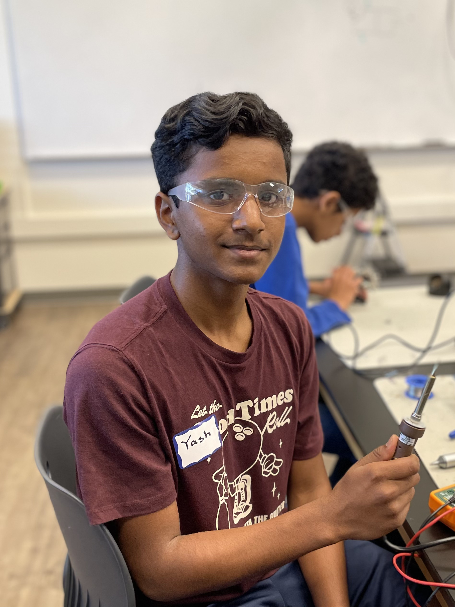
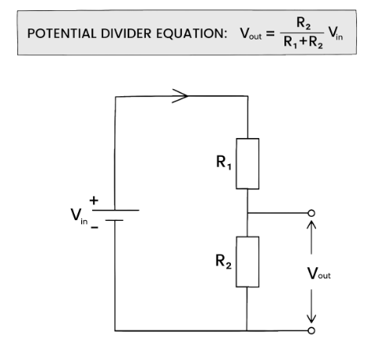
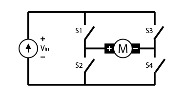
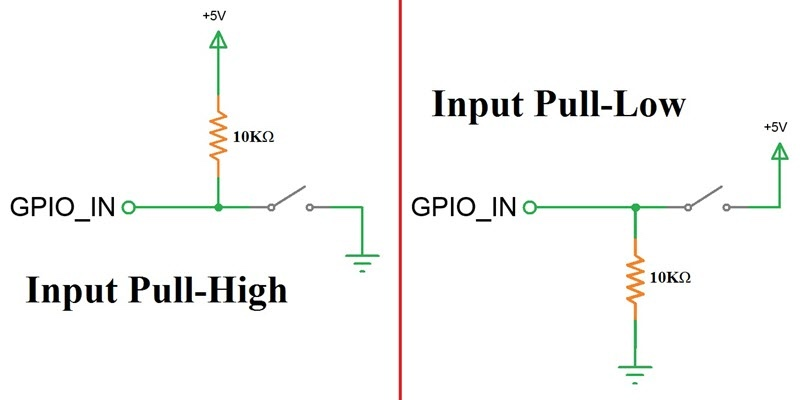

The Ball-tracking Robot uses the Raspberry Pi system along with the Open Computer Vision Library (OpenCV) to track a red ball with a camera. Once the ball is found, the robot drives, with 2 DC motors and a motor driver, towards the ball, gauging the distance to the ball with an ultrasonic sensor. In this portfolio, I will describe the process I took to assemble and program the robot, any materials I used along the way, along with relevant schematics and diagrams where neccesary.

| **Engineer** | **School** | **Area of Interest** | **Grade** |
|:--:|:--:|:--:|:--:|
| Yash S. | Leland High School | Mechanical Engineering / Robotics | Incoming Sophmore



*** 

# Modification 1
For my first modification, I have added a pan-tilt servo mount that allows the robot to track the ball while stationary and while moving.

### Summary
After adding my pan-tilt servo mount, with a servo to move the camera left and right (pan) and a servo to move it up and down (tilt), I used the following code to test its functionality;
```python
import pigpio
import time
from picamera2 import Picamera2
import cv2
import time
from ball import find_color_mask, find_largest_contour
import os

# Setup the camera
redLower = (150, 140, 1)
redUpper = (190, 255, 255)

picam2 = Picamera2()
picam2.configure(
    picam2.create_preview_configuration(main={"format": "RGB888", "size": (320, 240)})
)
picam2.start()
time.sleep(1)

# Setup the pan-tilt servo
pan = 16
tilt = 26

pan_a = 1500
tilt_a = 1500

v_direction = "none"
h_direction = "right"

pwm = pigpio.pi()

pwm.set_mode(pan, pigpio.OUTPUT)
pwm.set_mode(tilt, pigpio.OUTPUT)

pwm.set_PWM_frequency(pan, 50)
pwm.set_PWM_frequency(tilt, 50)

# Turn the servos to their default position
print("90 deg")
pwm.set_servo_pulsewidth(pan, 1500)
pwm.set_servo_pulsewidth(tilt, 1500)
time.sleep(1)

found = False

while True:
    # Process the frame and track the ball
    frame = picam2.capture_array()

    mask = find_color_mask(frame)
    x, y, radius, center, area = find_largest_contour(mask)

    if radius > 20:
        found = True
        cv2.circle(frame, (int(x), int(y)), int(radius), (255, 0, 0), 2)
        cv2.circle(frame, center, 5, (255, 0, 0), -1)
    else:
        found = False

    # Turn the pan servo left or right and the tilt servo up or down depending on where the ball is
    if found:
        if x < 150:
            h_direction = "left"
            if pan_a < 2500:
                pan_a += 10
            pwm.set_servo_pulsewidth(pan, pan_a)
        elif x > 170:
            h_direction = "right"
            if pan_a > 500:
                pan_a -= 10
            pwm.set_servo_pulsewidth(pan, pan_a)

        if y > 130:
            v_direction = "up"
            if tilt_a < 2500:
                tilt_a += 10
            pwm.set_servo_pulsewidth(tilt, tilt_a)
        elif y < 110:
            v_direction = "down"
            if tilt_a > 500:
                tilt_a -= 10
            pwm.set_servo_pulsewidth(tilt, tilt_a)

    # If the ball was lost, move in the last direction you saw it
    elif v_direction != "none" and h_direction != "none":
        if h_direction == "left":
            if pan_a < 2500:
                pan_a += 10
            pwm.set_servo_pulsewidth(pan, pan_a)
        elif h_direction == "right":
            if pan_a > 500:
                pan_a -= 10
            pwm.set_servo_pulsewidth(pan, pan_a)

        if v_direction == "up":
            if tilt_a < 2500:
                tilt_a += 10
            pwm.set_servo_pulsewidth(tilt, tilt_a)
        elif v_direction == "down":
            if tilt_a > 500:
                tilt_a -= 10
            pwm.set_servo_pulsewidth(tilt, tilt_a)

    cv2.imshow("Feed", frame)  # Shows frame with bounding box

    if cv2.waitKey(1) & 0xFF == ord("q"):  # Press q to break the loop and stop moving
        break


# Cleanup
pwm.set_PWM_dutycycle(pan, 0)
pwm.set_PWM_dutycycle(tilt, 0)

pwm.set_PWM_frequency(pan, 0)
pwm.set_PWM_frequency(tilt, 0)

cv2.destroyAllWindows()
picam2.stop()
```

This code uses the same vision logic as the ball tracking robot itself but uses the ```pigpio``` library to reduce the servo jitter and turns the servos based on the ball's location. This way, the pan-tilt servo mount always moves to keep the ball centered in the frame of the camera.

Now that I knew that the pan-tilt servo mount was functional, I implemented this code with my final milestone code to make a robot with 2 modes; the first being regular ball tracking, and the second being stationary ball tracking that allows for up-down ball tracking in opposition to just following the ball on the ground with only the left-right axis. (Check main code)

### Challenges
My main challenge with my first modification was the servo jitter, as before using the ```pigpio``` library, servo movements were very shaky and not smooth due to serial noise. However, after using the recommended libraries, the servo jitter was fixed and my servos were much more smooth and precise.

In addition, I was originally using my current simple code to incrementally change the servo angles depending on the side of the axes the ball was on, but I tried actively calculating the optimal servo angles to point at the ball with linear regression and a decent amount of trigonometry. This made it so that the servo would move more the further it was from the ball and would move exactly to one position instead of slowly loving until meeting a position. Unfortunately, that method was not very precise and caused a lot of jitter and imprecision, so I ended up switching back to my simple model for the most reliability.

***

# Final Milestone
For my final milestone, I have completed my ball-tracking code with obstacle detection and have tested and fine-tuned my parameters for my vision-based tracking. I also have added 2 additional ultrasonic sensors for more accurate obstacle detection.

### Summary
I included many logic layers in my code to ensure every edge case would be handled properly or the action would be skipped. 

First, I check whether an obstacle is detected to avoid a collision:
```python
if not no_obstacle(distance_C, distance_L, distance_R):
        print("Obstacle detetcted")
        stop()
        sleep(0.05)
```

If there is no obstacle, then we check whether we are still searching for the ball (not seen yet), and if so, spin right to make first contact with the ball:
```python
elif not found:
        sharp_right()
        sleep(0.05)
        stop()
```

Once the ball is found, we check whether the ball is on the left or right, log that as the last direction seen, and move in that direction:
```python
elif found and in_frame:
        if x > 210:
            direction = "right"
            sharp_right()
        elif x < 110:
            direction = "left"
            sharp_left()
        elif 110 <= x <= 210:
            forward()
        sleep(0.05)
        stop()
```

If the ball is moving, or for some reason leaves the camera frame, we move in the direction we last saw the ball:
```python
elif found and not in_frame:
        if direction == "right":
            sharp_right()
        elif direction == "left":
            sharp_left()
        sleep(0.05)
        stop()
```
By splitting up the tracking process into stages, I can efficiently find and actively navigate to the ball.

In addition, I added 2 more ultrasonic sensors to increase the accuracy of obstacle detection:
```python
# Setup ultrasonic sensor
Trigger_C = 22
Echo_C = 18
Trigger_L = 31
Echo_L = 29
Trigger_R = 33
Echo_R = 32

GPIO.setup(Trigger_C, GPIO.OUT)  # Trigger 1
GPIO.setup(Echo_C, GPIO.IN)  # Echo 1

GPIO.setup(Trigger_L, GPIO.OUT)  # Trigger 1
GPIO.setup(Echo_L, GPIO.IN)  # Echo 1

GPIO.setup(Trigger_R, GPIO.OUT)  # Trigger 1
GPIO.setup(Echo_R, GPIO.IN)  # Echo 1

GPIO.output(Trigger_C, False)
GPIO.output(Trigger_L, False)
GPIO.output(Trigger_R, False)
```

With these sensors, I can make sure that my obstacle detection is as accurate and quick as possible.

### Challenges
My main challenge in building this milestone was the ultrasonic sensors, adding two more voltage dividers on the same breadboard proved extremely messy and disorganized, and I had to keep track of my wires to make sure everything was compact enough to work. Additionally, the logic of my code was tricky to debug and process, but I was able to debug and fine-tune my code to make the process as smooth as possible.

Now, I'll move on to building modifications for my project, like a pan-tilt servo head or a camera display.

<iframe width="560" height="315" src="https://www.youtube.com/embed/HNnNtqBADoQ?si=pBmaDHtq0rOcG0nd" title="YouTube video player" frameborder="0" allow="accelerometer; autoplay; clipboard-write; encrypted-media; gyroscope; picture-in-picture; web-share" referrerpolicy="strict-origin-when-cross-origin" allowfullscreen></iframe>

***

# Second Milestone
For my second milestone, I have completed building my ultrasonic sensor voltage divider and circuit and have built and tested my ball-tracking code with OpenCV.

### Summary
To assemble my ultrasonic sensor circuit, I used a voltage divider [^9] with a 1K and 2K Ohm resistor to connect the 5V Ultrasonic sensor to my 3.3V operating Raspberry Pi. For my OpenCV software, my program has two main parts; the first is capturing camera footage with PiCamera2 [^10] (A PiCamera Library for camera functions) and using OpenCV (cv.imShow()) [^11] to show the frame on a preview. The second is image processing, using OpenCV to resize the image, blur the frame to reduce noise, and then generate a color mask for red with the HSV color space, dilating and eroding the image for even more precision. Then, a separate function takes in the color mask and finds the largest contour, identifying the ball quickly and precisely.



*Figure 1: How a voltage divider works and how to calculate the output: [https://studymind.co.uk/notes/potential-dividers/](https://studymind.co.uk/notes/potential-dividers/)*

As shown above, two resistors, in series allow us to alter the voltage sent to Vout, which will be smaller than Vin

### Testing
To test my ball-tracking functionality and my ultrasonic sensor, I used 2 additional test programs.

Here is my ultrasonic sensor testing program:
```python
from gpiozero import DistanceSensor

ultrasonic = DistanceSensor(echo=24, trigger=25)

while True:
    print(ultrasonic.distance)
```
This program sets up the ultrasonic sensors with the respective board pins and prints the distance received from the sensor continuously.

Here is my ball-tracking test code:
```python
from picamera2 import Picamera2
import numpy as np
import cv2
import time

redLower = (150, 140, 1)
redUpper = (190, 255, 255)

picam2 = Picamera2()
picam2.configure(picam2.create_preview_configuration(main={"format": 'RGB888', "size": (320, 240)}))
picam2.start()
time.sleep(2)

#Returns a mask of all colors within the red HSV space
def find_color_mask(frame):
	#Blur the image and convert to HSV color space
	blurred = cv2.GaussianBlur(frame, (11, 11), 0)
	hsv = cv2.cvtColor(blurred, cv2.COLOR_BGR2HSV)
	
	#Erode and Dilate to remove noise
	mask = cv2.inRange(hsv, redLower, redUpper)
	mask = cv2.erode(mask, None, iterations=2)
	mask = cv2.dilate(mask, None, iterations=2)
	
	return mask

#Finds the largest "blob" on the screen
def find_largest_contour(frame):
	# Finds contours in the provided image
	cnts, _ = cv2.findContours(frame.copy(), cv2.RETR_EXTERNAL, cv2.CHAIN_APPROX_SIMPLE)
	if len(cnts) > 0:
		c = max(cnts, key=cv2.contourArea)
		((x, y), radius) = cv2.minEnclosingCircle(c)
		M = cv2.moments(c)
		center = (int(M["m10"] / M["m00"]), int(M["m01"] / M["m00"]))
	else:
		(x, y) = (0, 0)
		radius = 5
		center = (0, 0)
	
	return x, y, radius, center
	

while True:
	frame = picam2.capture_array()
	
	if frame is None:
		print("Error: Frame not captured")
		break
	
	mask = find_color_mask(frame)
	
	x, y, radius, center = find_largest_contour(mask)
	
	if radius > 10:
			# draw the circle and centroid on the frame,
			# then update the list of tracked points
			cv2.circle(frame, (int(x), int(y)), int(radius), (255, 0, 0), 2)
			cv2.circle(frame, center, 5, (255, 0, 0), -1)
	
	cv2.imshow("Tracking", frame)
	
	if(cv2.waitKey(1) & 0xff == ord('q')): #Press q to break the loop and stop moving 
		break

cv2.destroyAllWindows()
picam2.stop()
```
As explained, the code processes the current frame from the live camera feed and draws a circle around the detected ball.

Using this code, we can test to see that our ultrasonic sensor records accurate distances and that our ball-tracking functionality works.

### Challenges
My main challenge with this milestone was the ultrasonic sensor, while making the circuit I accidently fried a sensor due to an incorrect connection, but after replacing the sensor and verifying my layout, the sensor worked as expected

Now, I'll move on to building my main code, compiling together all of my work so far.

<iframe width="560" height="315" src="https://www.youtube.com/embed/hbq9Ot5CEPs?si=ffv2ASKm7EyYdEfE" title="YouTube video player" frameborder="0" allow="accelerometer; autoplay; clipboard-write; encrypted-media; gyroscope; picture-in-picture; web-share" referrerpolicy="strict-origin-when-cross-origin" allowfullscreen></iframe>

***

# First Milestone
For my first milestone, I completed the construction of the robot kit and all the wiring and tested that the robot and camera work with camera and motor testing code. 

### Summary
On the top of the robot is a Raspberry Pi 4B, powered by a large lithium-ion power bank and connected to the ArduCam 5MP camera in an acrylic case. On the bottom, we have a 2 H-Bridge [^6] (A circuit that can reverse polarity) motor driver wired up with two 6V DC [^7] (Direct current) motors. This driver is powered by four AA batteries, providing 6V of power to the driver, in series [^8] with this switch that can open or close the circuit to control whether the motor driver is on. Finally, the bridge between the two sides, 4 jumper wires, two for each motor, come in from the Raspberry Pi and are inputted into the motor driver to control the motors.



*Figure 2: H-bridge circuit: [https://digilent.com/blog/what-is-an-h-bridge/#:~:text=An%20H%2Dbridge%20is%20built,directions%20by%20closing%20two%20switches.](https://digilent.com/blog/what-is-an-h-bridge/#:~:text=An%20H%2Dbridge%20is%20built,directions%20by%20closing%20two%20switches.)* 

As shown above, if 1 and 4 were closed, the current would flow to the right through the motor, making it spin in one direction. However, if 2 and 3 are closed, then the current flows to the left through the motor, spinning it the other way. This way, we can control the motors with 4 switches instead of 4 wires.

### Testing
To test the functionality of my robot, I used 2 test programs, one for the motors and one for the camera.

Here is a basic motor testing program:
```python
import RPi.GPIO as GPIO

GPIO.setmode(GPIO.BOARD)

MOTOR1B=15 # LEFT motor
MOTOR1E=16
  
MOTOR2B=11 # RIGHT motor
MOTOR2E=13

GPIO.setup(MOTOR1B, GPIO.OUT)
GPIO.setup(MOTOR1E, GPIO.OUT)
GPIO.setup(MOTOR2B, GPIO.OUT)
GPIO.setup(MOTOR2E, GPIO.OUT)

while(True):
	userInput = input()
	
	if(userInput == 'w'):
		GPIO.output(MOTOR1B,GPIO.LOW)
		GPIO.output(MOTOR1E,GPIO.HIGH)
		GPIO.output(MOTOR2B,GPIO.HIGH)
		GPIO.output(MOTOR2E,GPIO.LOW)

	if(userInput == 'a'):
		GPIO.output(MOTOR1B,GPIO.HIGH)
		GPIO.output(MOTOR1E,GPIO.LOW)
		GPIO.output(MOTOR2B,GPIO.HIGH)
		GPIO.output(MOTOR2E,GPIO.LOW)
                
	if(userInput == 's'):
		GPIO.output(MOTOR1B,GPIO.HIGH)
		GPIO.output(MOTOR1E,GPIO.LOW)
		GPIO.output(MOTOR2B,GPIO.LOW)
		GPIO.output(MOTOR2E,GPIO.HIGH)
            
	if(userInput == 'd'):
		GPIO.output(MOTOR1B,GPIO.LOW)
		GPIO.output(MOTOR1E,GPIO.HIGH)
		GPIO.output(MOTOR2B,GPIO.LOW)
		GPIO.output(MOTOR2E,GPIO.HIGH)
        
	if(userInput == 'x'):
		GPIO.output(MOTOR1B,GPIO.LOW)
		GPIO.output(MOTOR1E,GPIO.LOW)
		GPIO.output(MOTOR2B,GPIO.LOW)
		GPIO.output(MOTOR2E,GPIO.LOW)
		
	if(userInput == 'end'):
		GPIO.cleanup()
		break
```
This program uses WASD inputs to direct the directions of the motors, using a ```while True``` loop to make testing easier and using the 'end' key to break out of the infinite loop and cleanup the GPIO outputs

Now, here is some basic camera testing code:
```python
from picamera2 import Picamera2
import numpy as np
import cv2
import time

picam2 = Picamera2()
picam2.configure(picam2.create_preview_configuration(main={"format": 'RGB888', "size": (320, 240)}))
picam2.start()
time.sleep(2)

while True:
    frame = picam2.capture_array()
    
    if frame is None:
        print("Error: Frame not captured")
        break
    
    cv2.imshow("Tracking", frame)

    if(cv2.waitKey(1) & 0xff == ord('q')): #Press q to break the loop and stop moving 
        break

cv2.destroyAllWindows()
picam2.stop()
```
This code has 2 main parts, with a library for each:

1. The PiCamera2 Library helps us configure the camera with ```PiCamera2()``` and captures the current frame every few milliseconds with ```picam2.capture_array()```

3. The OpenCV library helps us take the current frame captured by PiCamera2 and display it in a preview window, updating it on new frame from ```picam2```

We can efficiently test and debug our camera and motors with these two programs, allowing us to continue building the robot's full code.

### Challenges
My main challenge with this process was that almost every part of the kit was broken, including the battery pack which didn't supply any voltage, the motor driver which gave no output voltage, and the switch that melted and wouldn't turn on. I had to replace the battery pack and motor driver and use a Dremel Saw to make a larger hole for a new switch. In addition, I was originally connecting power to +5V, but this was incorrect, I had to connect it to VCC, and once I fixed this error, the motors worked normally and I could control the robot as I wanted. VCC accepts up to +12V on this driver and should always be used. The +5V port only exists for additional power supply in case of excessive voltage load on the driver itself.

Now, I am ready to move on to my second milestone, building and testing OpenCV ball-tracking code on my Raspberry Pi.

<iframe width="560" height="315" src="https://www.youtube.com/embed/S4u5ani-CXQ?si=F4eayMsDoPPQVb7L" title="YouTube video player" frameborder="0" allow="accelerometer; autoplay; clipboard-write; encrypted-media; gyroscope; picture-in-picture; web-share" referrerpolicy="strict-origin-when-cross-origin" allowfullscreen></iframe>

***

# Starter Project
For my starter project, I built the calculator ([link](https://www.amazon.com/Kit-Calculator-Resistance-Electronic-HUAGZIMO/dp/B0D13C9SYT/ref=sr_1_3?crid=3HGJTLNZ9O2GX&dib=eyJ2IjoiMSJ9._SWtzcdxglPoBR9j02Ru8HdkQYctYGhXoQSzf1MVwW8-wdJNSkQkLmCAtn4dRp6g-6R7J9461vhIP2EF_nk7Tig6XDG9bCrlMTSlmck5MBQwLRhhnSiQUGo0QJa1GwgSj6a6-1yBKFqneN2-Z0AqO-StnMGL2G8655x5qfsjKhjBt48dYiTRy3_0E2_Jk5agtyEMTLExRFtYVrPI5ML2CKLPh8c4dT4clp-o5in2kS0.ajrpXguZyLba8zZbq_b1WT_1ccEQlOe_PpesP9bkSUM&dib_tag=se&keywords=calculator+solder&qid=1717994208&sprefix=calculator+solde%2Caps%2C148&sr=8-3)), because I thought it would be a fun way to get better at soldering and a fun project to find later on and use to my liking. It can perform all standard operations, including addition, subtraction, multiplication, and division, even with decimals.

### Summary
The main components of the calculator are the General Purpose Input Output [^1] (GPIO) buttons, which can either be in a HIGH or LOW state. These signals are sent electrically to this chip, acting as the "brain" of the calculator. It contains Floating Point units (FPU) [^2], which are tiny circuits that process the floating point numbers and send an output to these two seven-segment displays [^3]. These displays can display digits from 0-9 in addition to decimal points, and update on signal from the chip. They are a simpler way to display floating-point numbers than more complex matrix displays, due to only having seven main Light-emitting diode (LED) [^4] segments. We also have a micro USB adapter, allowing us to connect our calculator to a computer and edit code as needed. Finally, we have a battery socket and a CR2032 battery [^5], a standard 3-volt battery, which powers the entire calculator and can be removed and replaced as needed.



*Figure 3: How a GPIO button works: [https://www.electronicshub.org/raspberry-pi-push-button-interface/](https://www.electronicshub.org/raspberry-pi-push-button-interface/)*

On the left, we can see that this circuit "holds" the voltage of GPIO_IN at +5v by opening the circuit at the switch. On the right, the same way the voltage is held at 0V by opening the circuit and disconnecting the +5V source.

### Challenges
The most difficult challenge I faced during this build was related to the chip. There was originally an Integrated Circuit, or IC socket that the chip was placed in before soldering that made it easier to remove the chip. Still, a pin on the socket had broken, so after consideration, I decided that I would never need to remove the chip and soldered it onto the board to solve the problem. 

At this point, I will move on to my main project, the ball-tracking robot, and begin assembling my Raspberry Pi circuit and components.

<iframe width="560" height="315" src="https://www.youtube.com/embed/65gltkMqXt4?si=qwEcdHus98TpXgqG" title="YouTube video player" frameborder="0" allow="accelerometer; autoplay; clipboard-write; encrypted-media; gyroscope; picture-in-picture; web-share" referrerpolicy="strict-origin-when-cross-origin" allowfullscreen></iframe>

***

<!--
# Schematics 
Here's where you'll put images of your schematics. [Tinkercad](https://www.tinkercad.com/blog/official-guide-to-tinkercad-circuits) and [Fritzing](https://fritzing.org/learning/) are both great resoruces to create professional schematic diagrams, though BSE recommends Tinkercad becuase it can be done easily and for free in the browser. 
-->

# Full Code
Modification 1 Code:
```python
# Import motor and camera setup from our files
from motor import (
    forward,
    stop,
    sharp_left,
    sharp_right,
)
from ball import find_color_mask, find_largest_contour
from time import sleep
import RPi.GPIO as GPIO
import pigpio

pan = 16
tilt = 26

pan_a = 1500
tilt_a = 1500

v_direction = "none"
h_direction = "right"

pwm = pigpio.pi()

pwm.set_mode(pan, pigpio.OUTPUT)
pwm.set_mode(tilt, pigpio.OUTPUT)

pwm.set_PWM_frequency(pan, 50)
pwm.set_PWM_frequency(tilt, 50)

print("90 deg")
pwm.set_servo_pulsewidth(pan, 1500)
pwm.set_servo_pulsewidth(tilt, 1500)

GPIO.setmode(GPIO.BOARD)

# Setup ultrasonic sensor
Trigger_C = 22
Echo_C = 18
Trigger_L = 31
Echo_L = 29
Trigger_R = 33
Echo_R = 32

GPIO.setup(Trigger_C, GPIO.OUT)  # Trigger 1
GPIO.setup(Echo_C, GPIO.IN)  # Echo 1

GPIO.setup(Trigger_L, GPIO.OUT)  # Trigger 1
GPIO.setup(Echo_L, GPIO.IN)  # Echo 1

GPIO.setup(Trigger_R, GPIO.OUT)  # Trigger 1
GPIO.setup(Echo_R, GPIO.IN)  # Echo 1

GPIO.output(Trigger_C, False)
GPIO.output(Trigger_L, False)
GPIO.output(Trigger_R, False)


def sonar(GPIO_TRIGGER, GPIO_ECHO):
    start = 0
    stop = 0
    # Set pins as output and input
    GPIO.setup(GPIO_TRIGGER, GPIO.OUT)  # Trigger
    GPIO.setup(GPIO_ECHO, GPIO.IN)  # Echo

    # Set trigger to False (Low)
    GPIO.output(GPIO_TRIGGER, False)

    # Allow module to settle
    time.sleep(0.01)

    # while distance > 5:
    # Send 10us pulse to trigger
    GPIO.output(GPIO_TRIGGER, True)
    time.sleep(0.00001)
    GPIO.output(GPIO_TRIGGER, False)
    begin = time.time()
    while GPIO.input(GPIO_ECHO) == 0 and time.time() < begin + 0.05:
        start = time.time()

    while GPIO.input(GPIO_ECHO) == 1 and time.time() < begin + 0.1:
        stop = time.time()

    # Calculate pulse length
    elapsed = stop - start

    # Distance pulse traveled in that time is time multiplied by the speed of sound (cm/s)
    distance = elapsed * 34300

    # That was the distance there and back, so take half of the value
    distance = distance / 2

    # Reset GPIO settings, return distance (in cm) appropriate for robot movements
    return distance


def no_obstacle(distance_c, distance_l, distance_r):
    if (
        distance_c > sensor_proximity
        and distance_l > sensor_proximity
        and distance_r > sensor_proximity
    ):
        return True
    else:
        return False


# Setup motors

MOTOR1B = 16  # LEFT motor
MOTOR1E = 15

MOTOR2B = 11  # RIGHT motor
MOTOR2E = 13

GPIO.setup(MOTOR1B, GPIO.OUT)
GPIO.setup(MOTOR1E, GPIO.OUT)
GPIO.setup(MOTOR2B, GPIO.OUT)
GPIO.setup(MOTOR2E, GPIO.OUT)

# Setup camera
from picamera2 import Picamera2
import cv2
import time

redLower = (150, 140, 1)
redUpper = (190, 255, 255)

picam2 = Picamera2()
picam2.configure(
    picam2.create_preview_configuration(main={"format": "RGB888", "size": (320, 240)})
)
picam2.start()
time.sleep(1)

# Ultrasonic Sensor proximity parameter (centimeter)
sensor_proximity = 10
rerouting_proximity = 17.5

# Computer vision lower and upper turning range parameters for tracking
lower_range = 30
upper_range = 290

found = False
in_frame = False
direction = "none"

while True:
    # Process current frame with our functions
    frame = picam2.capture_array()

    if frame is None:
        print("Error: Frame not captured")
        break

    height, width = frame.shape[:2]

    print(str(height) + " X " + str(width))

    mask = find_color_mask(frame)
    x, y, radius, center, area = find_largest_contour(mask)

    print("Area: " + str(area))

    print("Coordinates: " + str(x) + ", " + str(y))

    # Distance coming from front ultrasonic sensor
    distance_C = sonar(Trigger_C, Echo_C)
    distance_L = sonar(Trigger_L, Echo_L)
    distance_R = sonar(Trigger_R, Echo_R)
    print("D: " + str(distance_C) + ", " + str(distance_L) + ", " + str(distance_R))

    if radius > 40:
        if not found:
            found = True
            print("Found: " + str(found))
        in_frame = True
        cv2.circle(frame, (int(x), int(y)), int(radius), (255, 0, 0), 2)
        cv2.circle(frame, center, 5, (255, 0, 0), -1)
    else:
        in_frame = False

    if not no_obstacle(distance_C, distance_L, distance_R):
        print("Obstacle detetcted")
        stop()
        sleep(0.05)
    elif not found:
        sharp_right()
        sleep(0.075)
        stop()
    elif found and in_frame:
        if x > 260:
            direction = "right"
            sharp_right()
            sleep(0.075)
        elif x < 60:
            direction = "left"
            sharp_left()
            sleep(0.075)
        elif 110 <= x <= 210:
            forward()
            sleep(0.2)
        stop()
    elif found and not in_frame:
        if direction == "right":
            sharp_right()
        elif direction == "left":
            sharp_left()
        sleep(0.075)
        stop()

    print(direction)

    cv2.imshow("Feed", frame)  # Shows frame with bounding box

    if cv2.waitKey(1) & 0xFF == ord("q"):  # Press q to break the loop and stop moving
        stop()
        break

while True:
    frame = picam2.capture_array()

    mask = find_color_mask(frame)
    x, y, radius, center, area = find_largest_contour(mask)

    if radius > 20:
        found = True
        cv2.circle(frame, (int(x), int(y)), int(radius), (255, 0, 0), 2)
        cv2.circle(frame, center, 5, (255, 0, 0), -1)
    else:
        found = False

    if found:
        if x < 150:
            h_direction = "left"
            if pan_a < 2500:
                pan_a += 20
            pwm.set_servo_pulsewidth(pan, pan_a)
        elif x > 170:
            h_direction = "right"
            if pan_a > 500:
                pan_a -= 20
            pwm.set_servo_pulsewidth(pan, pan_a)

        if y > 130:
            v_direction = "up"
            if tilt_a < 2500:
                tilt_a += 20
            pwm.set_servo_pulsewidth(tilt, tilt_a)
        elif y < 110:
            v_direction = "down"
            if tilt_a > 500:
                tilt_a -= 20
            pwm.set_servo_pulsewidth(tilt, tilt_a)

    elif v_direction != "none" and h_direction != "none":
        if h_direction == "left":
            if pan_a < 2500:
                pan_a += 20
            pwm.set_servo_pulsewidth(pan, pan_a)
        elif h_direction == "right":
            if pan_a > 500:
                pan_a -= 20
            pwm.set_servo_pulsewidth(pan, pan_a)

        if v_direction == "up":
            if tilt_a < 2500:
                tilt_a += 20
            pwm.set_servo_pulsewidth(tilt, tilt_a)
        elif v_direction == "down":
            if tilt_a > 500:
                tilt_a -= 20
            pwm.set_servo_pulsewidth(tilt, tilt_a)

    cv2.imshow("Feed", frame)  # Shows frame with bounding box

    if cv2.waitKey(1) & 0xFF == ord("q"):  # Press q to break the loop and stop moving
        break

pwm.set_servo_pulsewidth(pan, 1500)
pwm.set_servo_pulsewidth(tilt, 1500)
sleep(1)

# Cleanup
pwm.set_PWM_dutycycle(pan, 0)
pwm.set_PWM_dutycycle(tilt, 0)

pwm.set_PWM_frequency(pan, 0)
pwm.set_PWM_frequency(tilt, 0)

cv2.destroyAllWindows()
picam2.stop()
GPIO.cleanup()

```


Final Milestone Code: 
```python
# Import motor and camera setup from our files
from motor import forward, reverse, leftturn, rightturn, stop, sharp_left, sharp_right, back_left, back_right
from ball import find_color_mask, find_largest_contour
from time import sleep
import RPi.GPIO as GPIO

GPIO.setmode(GPIO.BOARD)

# Setup ultrasonic sensor
Trigger_C = 22
Echo_C = 18
Trigger_L = 31
Echo_L = 29
Trigger_R = 33
Echo_R = 32

GPIO.setup(Trigger_C, GPIO.OUT)  # Trigger 1
GPIO.setup(Echo_C, GPIO.IN)  # Echo 1

GPIO.setup(Trigger_L, GPIO.OUT)  # Trigger 1
GPIO.setup(Echo_L, GPIO.IN)  # Echo 1

GPIO.setup(Trigger_R, GPIO.OUT)  # Trigger 1
GPIO.setup(Echo_R, GPIO.IN)  # Echo 1

GPIO.output(Trigger_C, False)
GPIO.output(Trigger_L, False)
GPIO.output(Trigger_R, False)

def sonar(GPIO_TRIGGER,GPIO_ECHO):
    start=0                     
    stop=0
    # Set pins as output and input
    GPIO.setup(GPIO_TRIGGER,GPIO.OUT)  # Trigger
    GPIO.setup(GPIO_ECHO,GPIO.IN)    # Echo
     
    # Set trigger to False (Low)
    GPIO.output(GPIO_TRIGGER, False)
     
    # Allow module to settle
    time.sleep(0.01)
         
    #while distance > 5:
    #Send 10us pulse to trigger
    GPIO.output(GPIO_TRIGGER, True)
    time.sleep(0.00001)
    GPIO.output(GPIO_TRIGGER, False)
    begin = time.time()
    while GPIO.input(GPIO_ECHO)==0 and time.time()<begin+0.05:
        start = time.time()
     
    while GPIO.input(GPIO_ECHO)==1 and time.time()<begin+0.1:
        stop = time.time()
     
    # Calculate pulse length
    elapsed = stop-start
    
    # Distance pulse traveled in that time is time multiplied by the speed of sound (cm/s)
    distance = elapsed * 34300
     
    # That was the distance there and back, so take half of the value
    distance = distance / 2

    # Reset GPIO settings, return distance (in cm) appropriate for robot movements 
    return distance

def no_obstacle(distance_c, distance_l, distance_r):
    if(distance_c > sensor_proximity and distance_l > sensor_proximity and distance_r > sensor_proximity):
        return True
    else:
        return False

# Setup motors

MOTOR1B = 16  # LEFT motor
MOTOR1E = 15

MOTOR2B = 11  # RIGHT motor
MOTOR2E = 13

GPIO.setup(MOTOR1B, GPIO.OUT)
GPIO.setup(MOTOR1E, GPIO.OUT)
GPIO.setup(MOTOR2B, GPIO.OUT)
GPIO.setup(MOTOR2E, GPIO.OUT)

# Setup camera
from picamera2 import Picamera2
import numpy as np
import cv2
import time

redLower = (150, 140, 1)
redUpper = (190, 255, 255)

picam2 = Picamera2()
picam2.configure(picam2.create_preview_configuration(main={"format": 'RGB888', "size": (320, 240)}))
picam2.start()
time.sleep(1)

# Ultrasonic Sensor proximity parameter (centimeter)
sensor_proximity = 10
rerouting_proximity = 17.5

# Computer vision lower and upper turning range parameters for tracking
lower_range = 30
upper_range = 290

found = False
in_frame = False
direction = "none"

while True:
    # Process current frame with our functions
    frame = picam2.capture_array()

    if frame is None:
        print("Error: Frame not captured")
        break

    height, width = frame.shape[:2]
    
    print(str(height) + " X " + str(width))

    mask = find_color_mask(frame)
    x, y, radius, center, area = find_largest_contour(mask)
    
    print ("Area: " + str(area))
    
    print("Coordinates: " + str(x) + ", " + str(y))

    # Distance coming from front ultrasonic sensor
    distance_C = sonar(Trigger_C, Echo_C)
    distance_L = sonar(Trigger_L, Echo_L)
    distance_R = sonar(Trigger_R, Echo_R)
    print("D: " + str(distance_C) + ", " + str(distance_L) + ", " + str(distance_R))
    
    if radius > 10:
        if not found:
            found = True
            print("Found: " + str(found))
        in_frame = True
        cv2.circle(frame, (int(x), int(y)), int(radius), (255, 0, 0), 2)
        cv2.circle(frame, center, 5, (255, 0, 0), -1)
    else:
        in_frame = False
    
    if not no_obstacle(distance_C, distance_L, distance_R):
        print("Obstacle detetcted")
        stop()
        sleep(0.05)
    elif not found:
        sharp_right()
        sleep(0.05)
        stop()
    elif found and in_frame:
        if x > 210:
            direction = "right"
            sharp_right()
        elif x < 110:
            direction = "left"
            sharp_left()
        elif 110 <= x <= 210:
            forward()
        sleep(0.05)
        stop()
    elif found and not in_frame:
        if direction == "right":
            sharp_right()
        elif direction == "left":
            sharp_left()
        sleep(0.05)
        stop()
    
    stop()
    
    print(direction)
    
    cv2.imshow("Feed", frame)  # Shows frame with bounding box

    if cv2.waitKey(1) & 0xff == ord('q'):  # Press q to break the loop and stop moving
        stop()
        break

cv2.destroyAllWindows()
picam2.stop()
GPIO.cleanup()
```

# Bill of Materials

| **Part** | **Note** | **Price** | **Link** |
|:--:|:--:|:--:|:--|
| Raspberry Pi 4B (4GB) | Computer used to process OpenCV algorithms and run code | $55 | [Adafruit Link](https://www.adafruit.com/product/4292?gad_source=1&gclid=CjwKCAjwjqWzBhAqEiwAQmtgT90CMD9fBQO5jZe9hAO2hHY35kJDs0KMfQkFNoEpym-fFbT87SJinhoCLmUQAvD_BwE) |
| ArduCam 5MP Camera | Used to capture video footage of the ball for the RPi | $12.99 | [Amazon Link](https://www.amazon.com/Arducam-Raspberry-Camera-Module-1080P/dp/B07RWCGX5K?ref_=ast_sto_dp&th=1&psc=1) |
| Robot kit | Physical structure, motors, battery pack, and switch | $12.99 | [Amazon Link](https://www.amazon.com/Smart-Chassis-Motors-Encoder-Battery/dp/B01LXY7CM3/ref=asc_df_B01LXY7CM3/?tag=hyprod-20&linkCode=df0&hvadid=693448563566&hvpos=&hvnetw=g&hvrand=3851559169840908154&hvpone=&hvptwo=&hvqmt=&hvdev=c&hvdvcmdl=&hvlocint=&hvlocphy=9032131&hvtargid=pla-584495246069&psc=1&mcid=3f54405bf4d93ae384d78ef10f75b962&gad_source=1) |
| Ultrasonic Sensors (3) | Used to gauge distance with ultrasonic waves | $5.50 | [Amazon Link (5 pack)](https://www.amazon.com/HC-SR04-Ultrasonic-Distance-Measuring-MEGA2560/dp/B088BT8CDW) |
| Breadboard | Used for prototyping and ultrasonic sensor voltage dividers | $2.47 | [DigiKey Link](https://www.digikey.com/en/products/detail/universal-solder-electronics-ltd/SOLDERLESS%2520BREADBOARD%2520400/16819785?utm_adgroup=&utm_source=google&utm_medium=cpc&utm_campaign=PMax_DK%2BProduct_Product%20Categories%20-%20Top%2015&utm_term=&utm_content=&utm_id=go_cmp-19646629144_adg-_ad-__dev-c_ext-_prd-16819785_sig-CjwKCAjw1emzBhB8EiwAHwZZxd6v-xSnrxKPvl7hmWV6exRQQ6x-2BGD0p4nHQ5W0mPDOCQUBKcy6xoClwMQAvD_BwE&gad_source=1&gclid=CjwKCAjw1emzBhB8EiwAHwZZxd6v-xSnrxKPvl7hmWV6exRQQ6x-2BGD0p4nHQ5W0mPDOCQUBKcy6xoClwMQAvD_BwE) |
| H-Bridge Motor driver | Used to control motors with direction | $2.30 | [Link](https://www.smart-prototyping.com/L298N-Dual-H-bridge-Motor-Driver-Board) |

***

# Resources 
[^1]: [GPIO Buttons](https://www.renesas.com/us/en/support/engineer-school/mcu-programming-peripherals-01-gpio) 
[^2]: [FPU (Floating point unit)](https://www.techopedia.com/definition/2865/floating-point-unit-fpu) 
[^3]: [Seven-segment displays](https://www.electronics-tutorials.ws/blog/7-segment-display-tutorial.html)
[^4]: [LED's (Light Emitting Diodes)](https://www.rohm.com/electronics-basics/leds/what-are-leds#:~:text=LEDs%20(Light%20Emitting%20Diodes)%20are,semiconductor%20(larger%20electron%20concentration).) 
[^5]: [CR2032 Battery](https://www.cr2032.co/cr2032-functions-article.html#:~:text=The%20CR2032%20battery%20uses%20a,like%20watches%20and%20remote%20controls.)
[^6]: [H-bridge circuits](https://digilent.com/blog/what-is-an-h-bridge/#:~:text=An%20H%2Dbridge%20is%20built,directions%20by%20closing%20two%20switches.) 
[^7]: [Direct current vs. Alternating current](https://learn.sparkfun.com/tutorials/alternating-current-ac-vs-direct-current-dc/all)
[^8]: [Series vs. Parallel Circuits](https://learn.sparkfun.com/tutorials/series-and-parallel-circuits/all) 
[^10]: [PiCamera2 Library](https://pypi.org/project/picamera2/0.2.2/)
[^11]: [OpenCV Preview](https://docs.opencv.org/3.4/dd/d43/tutorial_py_video_display.html)
